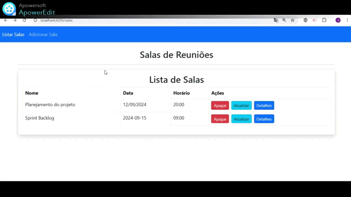

# Gerenciador de salas de reuniões com Angular e Java

Este projeto é uma aplicação web desenvolvida com Angular no frontend e Spring Boot no backend. O sistema permite gerenciar salas de reunião, oferecendo funcionalidades como criar, atualizar, listar e deletar salas.

## ✔️ Técnicas e tecnologias utilizadas
* Angular
* Spring Boot
* PostgreSQL

## 🔨 Funcionalidades do projeto

* Listar Salas: Exibe uma lista de todas as salas cadastradas.
* Adicionar Sala: Permite a criação de novas salas.
* Atualizar Sala: Atualiza as informações de uma sala existente.
* Deletar Sala: Remove uma sala do sistema.
* Visualizar Detalhes da Sala: Exibe as informações detalhadas de uma sala específica.

## 🛠️ Backend (Spring Boot)
O backend foi implementado utilizando Spring Boot e expõe uma API REST para realizar as operações de CRUD (Create, Read, Update, Delete) nas salas.

### Endpoints
    GET /sala: Retorna a lista de todas as salas.
###
    GET /sala/{id}: Retorna os detalhes de uma sala específica pelo ID.
###
    POST /sala: Cria uma nova sala.
###
    PUT /sala/{id}: Atualiza os dados de uma sala existente.
###
    DELETE /sala/{id}: Exclui uma sala com base no ID.

## 🎯 Frontend (Angular)
O frontend foi desenvolvido em Angular e consome a API REST do backend. A aplicação Angular exibe uma interface amigável para o gerenciamento das salas.

### Componentes Principais
* Lista de Salas: Exibe todas as salas cadastradas com opções para apagar, atualizar e visualizar detalhes.
* Formulário de Criação/Atualização: Formulário utilizado para adicionar ou editar uma sala.
* Detalhes da Sala: Exibe os detalhes de uma sala específica.
Navbar: Navegação entre as páginas de listagem e criação de salas.

### 🤝 Contribuições
* Contribuições são bem-vindas! Sinta-se à vontade para abrir problemas, propor melhorias ou enviar solicitações de pull.

 

⭐️ Star o projeto

🐛 Encontrar e relatar issues